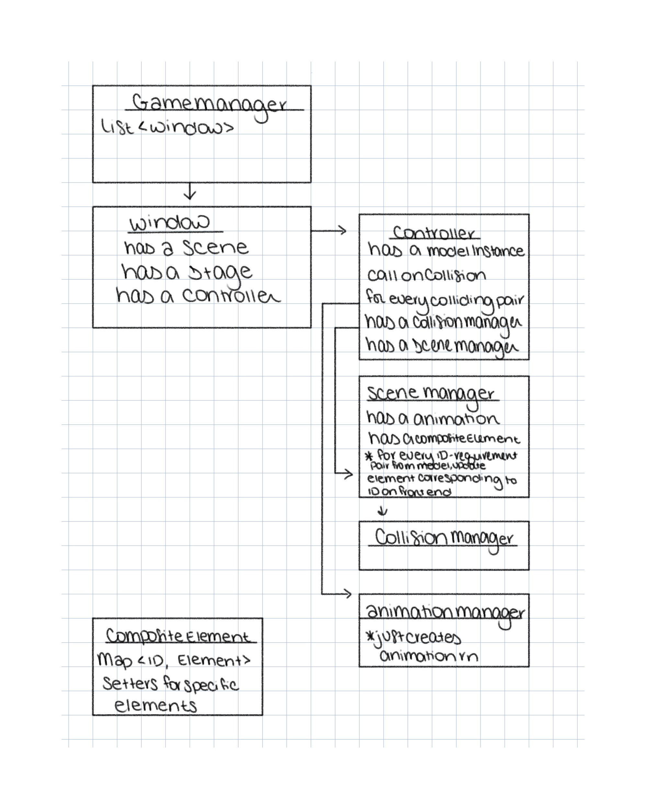

## Design Plan

### Front End

The view will be created with healthy dependency and tight scoping as a top priority. We've designed
our class structure to contain all game related objects and logic under a Window class to eventually
accommodate multiple game sessions. We are planning to utilize a controller to handle communications
between the front and back end. The controller will request information from a model instance and
delegate the handling of this information to various manager classes. This ensures that the scope of
the controller class is contained to model information requests and delegation of information
handling. The actual details of how the view is updated based on the info received from the model is
abstracted behind other classes. Our initial thoughts on class relationships is represented in the
UML diagram below. 

### Backend

The backend will support the building, parsing and running of various different turn-based physics games such as air hockey, mini golf, pinball, bowling, etc.
We plan to abstract the objects and rules for each game and to use design patterns to ensure its flexibility of handling games with very different functionalities.
...